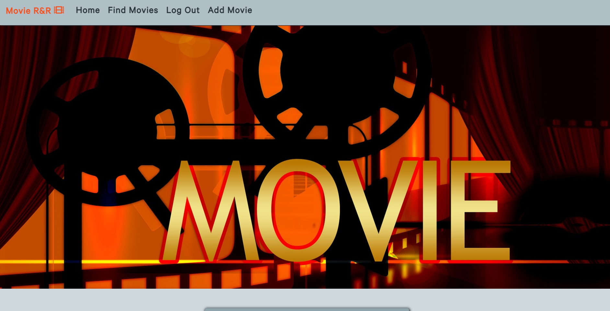

# Milestone Project 2

     

 This project is intended to provide a service for movie ratings and reviews. Users can search for different movies
 and read reviews and see ratings by other users. By registering and logging in a user can add their own reviews and
 ratings as well as edit and delete old reviews they have made in the past.

[Link to the deployed project](https://movie-r-and-r.herokuapp.com/)

# Table Of Contents

* [Database](#datbase)
* [UX](#ux)
* [Features](#features)
* [Technologies Used](#technologies-used)
* [Testing](#testing)
* [Deployment](#deployment)
* [Credits](#credits)

## Database

The database chosen for the project is MongoDB which is a NoSQL database. The two main enteties stored in the
datbase are users and movies. The user entety stores the username, password, email and an admin
check for different users. All of the fields are stored in simple key value pairs.
The movies entety stores data in both simple key value pairs and in a nested structure.
The simple key value pairs that are stored are title, director, rating, year and image URL
Reviews are stored in an array as a nested object with the key value pairs of author and description.
Cast is stored as an array of names and the has rated entety stores values of user names that has already 
rated a particular movie in an array.

## UX

### Overall purpose

The goal of the project is to create a fullstack website for accessing ratings and reviews for movies.
Any user should have the abbiltiy to see reviews and raitings for the avalible movies. Users should be able
to list all avalible movies in a sorted way as well as searching for particular ones. To add their own reviews
and ratings a user will be able to register and log in to an account. All users will have the option to delete 
and edit old reviews they have made. Any administrative user will have the abbiltiy to add new movies to the database
as well as editing and deleting old movies and deleting reviews made by other users.

### Goal of the developer

The goal of the developer is to showcase proficancy in creating a fullstack website. The project will inclued
writing HTML, CSS and JavaScript code for the frontend as well as writing Python code and
working with the MongoDB database and Flask framework on the backend. The file structure of the project has been
kept simple because of time restrictions, even though it is not the best practice. A better way would have been to use Flask Blueprints and
the Flask Applications Factory https://flask.palletsprojects.com/en/1.1.x/patterns/appfactories/.

### Design

The Calibre font was used throughout the website to add some uniqueness to the site 
while still being very clear and readable. A few design alterations was made from the initial mockups as in a few color
alterations but the main structure and design follows the wireframes and mockups.

### User Stories

#### Regular user

* As a user I want access to others reviews and rating of relevant movies.

* As a user I want to be able to write my own reviews and add my own ratings.

* As a user I want to be able to edit and delete my own reviews.

* As a user I want to option to search for movies as well as being able to scroll through a selection of movies.

* As a user I want a clear response to my actions such as adding, deleting and editing my reviews.

* As a user I want navigation to be clear and consistent across the website.

* As a user I want the top rated movies to be displayed when visiting the website.

#### Administrative user

* As an administrator I want to be able to add new movies to the database.

* As an administrator I want to be able to edit already added movies.

* As an administrator I want to be able to delete reviews made by other users.

#### Wireframes and Mockups

* [Wireframe Mobile](static/images/wireframes-mockups/wireframe-mobile.png)
* [Wireframe Tablet](static/images/wireframes-mockups/wireframe-tablet.png)
* [Wireframe Desktop](static/images/wireframes-mockups/wireframe-desktop.png)

* [Mockup Mobile](static/images/wireframes-mockups/mockup-mobile.png)
* [Mockup Tablet](static/images/wireframes-mockups/mockup-tablet.png)
* [Mockup Desktop](static/images/wireframes-mockups/mockup-desktop.png)
   

## Features

### Existing Features

* A navigation bar at the top where users can navigate the site, looks the same accross the pages.

* A footer with social media links which sits at the bottom of the screen and looks the same across the pages.
(Do not link to an actual account since the purpose of the site is educational)

#### Index page

* Three carousels which displays movies based on date added, release year and ratings.

* A register form where new users can register an account. When a user registers succesfully they will 
recive a welcome email.

* A log in form where users can log in to an existing account.

#### Findmovies page

* A list of links to all the movies in the database that displays their title, release year and raiting.

* Pagination which limits the above movie list to only display ten movies at a time.

* A dropdown with options to sort the movie list by date added, release year and rating.

* A search bar where users can search for particular movies.

* A link to return to display all movies if a search has been made.

#### Moviepage

* A page for each movie wich displays descriptions of the movie, ratings and reviews.

* A slider where logged in users can add their own rating.

* A text form where logged in users can write and submit their own reviews.

* An accordion with all the current reviews for that movie.

* Abiilty to edit and delete reviews made by the user themselves.

#### Administrative features

* An add movie page where admins can add new movie by filling out a form.

* Links from the movie page where admins can delete movies and reviews as well as
edit movies.

### Future Features

* Abiilty to reset a lost password for already registered users by sending a reset password link.

* Embedding trailers/video clips of the movies from services as YouTube.

## Technologies Used

* HTML

For the basic structure of the web page.

* CSS

For the styling of the HTML elements.

* JavaScript

To add interactivity to the project.

* [Flask](https://flask.palletsprojects.com/en/1.1.x/)

Flask was used in conjunction with the [Jinja2](https://jinja.palletsprojects.com/en/2.11.x/) templating language
to generate the HTML templates on the backend. It was also used to access and process the data sent from the frontend to 
the server. 

* [Python](https://www.python.org/)

Custom Python code was written in conjunction with Flask to handle all of the backend processes.

* [MongoDB](https://www.mongodb.com/3)

MongoDB was the database used to store all of the information about the movies and users in the project.

* [JQuery](https://jquery.com/)

JQuery functions where used to manipulate the DOM, take actions and do AJAX calls.

* [Bootstrap](https://getbootstrap.com/)

Bootstrap was used to provide structure and responsiveness to the site by using their container
, row and col classes. Carousels, a dropdown, a
accordion, a pagination element and some cards were components that where inclued from Bootstrap.

* [Github](https://github.com/)

Github was used to store the repository.

* [Gitpod](https://www.gitpod.io/)

Gitpod was the IDE used to create the project.

* [Git](https://git-scm.com/) 

For version control through the gitpod terminal.

* [Adobe XD](https://www.adobe.com/products/xd.html)

Adobe XD was used to create the wireframes and mockups for the project.

* [Materialize](https://materializecss.com/)

Materialize was not used directly in the project but the colors were chosen by using their color palette.

* [Chrome DevTools](https://developers.google.com/web/tools/chrome-devtools)

Chrome DevTools was heavily used throughout the project,  mainly by debugging and testing with help of the console and
checking the responsiveness of the page with their screen rendering tools.

* http://whatismyscreenresolution.net/multi-screen-test 

For testing the responsiveness across different devices.

* https://en.bestfonts.pro/font/calibre

For downloading the Calibre font.

## Testing

* The CSS was run through the https://jigsaw.w3.org/css-validator/ without any errors found.

* The HTML was run through the https://validator.w3.org/, the errors that are found are all related to
the Jinja2 templating language. Since Flask is creating HTML files by using templates and injecting variables
from the backend the validator gives errors that are not acually present at runtime.

* The JavaScript was run through the https://jshint.com/ linter, no errors found. Two warnings occur regarding 
unused variables, these can be ignored since these functions are used and called when submitting forms.

* The cornflakes(flake8) linter was installed as an extension to the development environment and validated
the Python code throughout the project.

* The responsiveness was tested by simulating a vide variety of devices such as phones, tablets and desktops using
the Chrome DevTools and http://whatismyscreenresolution.net/multi-screen-test.

* The site was tested on three different browsers: Google Chrome, Mozilla Fireforx and Microsoft Edge.

### Manual tests of functions and features

#### Navigation bar

* Clicking the links for Home, Findmovies, Add movies and brand logo link.

**Expected:** all links should load the intended page.  

**Result:** every link loads their intended page.

* Clicking the Log in and Register links.

**Expected:** both links skould open their respective modal for logging in and registering.  

**Result:** both links open their respective modal.

* Clicking the Log out link

**Expected:** Index page should be loaded, an alert message should be displayed and the user should be logged out
by removing the session cookie "user" and "admin" incase the user is and admin.

**Results:** The index page loads, an alert message saying the user has been logged out displays, all links
to logged in functions dissapears and the session cookie "user" dissapears as well as the "admin" session cookie
incase the user was an admin.

* Filling out and submitting Log in form.

**Expected:** the form should only be submittable with all fields being filled in. If a correct password and username is
entered the index page should load and a welcome message would be displayed. If an incorrect password or username
is entered the index page should be loaded with and error message being displayed.  

**Result:** form is only submittable when all fields are filled in, if a correct password and username is provided
the index page loads and an welcome message diplays. If an incorrect password or username is entered the index page
loads and an errror message is displayed.

* Filling out and submitting Register form.

**Expected:** The form should only be submittable if all the fields are filled in as well as containing values
which matched the specified patterns. If a username is taken the index page should load and an error message should
be displayed. If the registration is succesfull the index page should load and a welcome message should be displayed,
a welcome mail should also be sent to the users email address.

**Result:**: The form is only submittable when all of the fields are entered, it also requires that the format 
of the input matches the pattern specified. When trying to register an account with a already taken username the
index page loads and an error message is displayed. When a registration is succesfull the index page loads and
a welcome message is displayed. A welcome mail is also recived to the submitted email address but sometimes 
appears in the junk mail folder.

* Clicking the redirect links from the Log in and Register modals

**Expected:** The links skould open the opposite modal as well as closing the current one.

**Results:** Both links open the opposite modal and closes the current one.

* Clicking the close button from the Log in and Register modals.

**Expected** Clicking the button should close the current modal.

**Results:** The current modal closes.

* Clicking the Add Movie button/link as an admin.

**Expected:** The addmovie page should load and a form to fill out fields describing the movie should display.
The form should not be submittable if not all fields are filled in. The filled in fields shoukd require
the input tp follow the specified pattern. Upon submitting the form the index page should load, the movie
should be added to the database and a message stating that the movie was added should be displayed. In case the 
title already exists in the database the index page should load and a message saying that the movie already exists 
should diplay.

**Results:** When an admin presses the Add Movie button the addmovie page loads and form for adding a movie displays.
The form is only submittable when all fields are filled in. The input is required to follow the specified patterns
before submitted. Upon submitting the form the index page loads, the movie is added to the database and a message
stating that the movie was added displays. In case the 
title already exists in the database the index page loads and a message saying that the movie already exists 
displays and nothing is added to the database.

#### Footer 

* Clicking any of the social media links

**Expected:** All links skould open the index page of their respective brands website in a new tab.

**Results:** All links open their respective brands websites index page in a new tab.

#### Index page

* Clicking the Log in and Reggister buttons on the main card.

**Expected:** Links skould open their respective Log in and Register modal.

**Result**: Both links open their intended modal.

#### Find Movies page

* Using the search bar function.

**Expected:** Searching for movies with names that match results in the database should
display those results in a list. When no results are found a message that no results were found 
should appear.

**Results:** When finding a match the site displays the results in a list. When no results are found
a text stating "No search results found" appear.

* Using the dropdown to sort the movie list.

**Expected:** Sorting the list by date added should diplay the last add movies in a descending order by
date added. Sorting it by ratings and release year should also sort the list in a descending order by
rating and release year respectivley.

**Results:** The list sorts correctly by the right parameters and in a descending order.

* Clicking the Back to all movies link

**Expected:** Clicking the link should reload the Find Movies page and display all movies in a list.

**Results:** Page reloads and all movies are displayed.

* Clicking a link to a movie.

**Expected:** Clicking the link should load that particular movies page.

**Results:** The correct movie page loads.

* Navigating the pagination buttons.

**Expected:** The number one button should display the first ten movies in the database, the second
button the next ten movies and so on.

**Results:** The buttons navigate to the right pages and displays the corresponding movies.

#### Movie page

* Submitting a rating as a logged in user.

**Expected:** When a user rates and submits their raiting the current movie page should reload and a 
message should be displayed. If the user has rated the movie before the rating should not be added and the message
should read "You have already rated this movie". If the user have not rated the movie before the rating should be
added and the message should read "Your rating was added".

**Results:** Upon submitting the rating the page reloads, if the user have not made a rating yet the rating is added
to the database and the text displays "Your rating was added". If a user previously has rated the movie the text displays
"You have already rated this movie" and the rating is not added to the database.

* Submitting a review as a logged in user.

**Expected:** When a user rates and submits their review the current movie page should reload and a 
message should be displayed. If the user has made a review for the movie before the review should not be added and the message
should read "You have already made a review for this movie". If the user have not made a review for the movie before the review should be
added and the message should read "Your review was added".

**Results:** Upon submitting the review the page reloads, if the user have not made a review yet the it is added
to the database and the text displays "Your review was added". If a user previously has reviewed the movie the text displays
"You have already made a review for this movie" and the review is not added to the database.

* Pressing the delete button on a review made by the current user or by an admin.

**Expected:** A confirmation modal should display where the user can confirm the deletion. If the cancel button is pressed
the modal should close, if the user confirms the deletion by pressing delete again the page should reload and
the review should be deleted.

**Results:** When a logged in user presses the delete review button on a review they have made or alternativly
if the user is an admin and presses delete on any review a deletion confirmation modal displays.
If the user pressses cancel the modal closes, if the user presses delete again the review is deleted and the page
reloads.

* Pressing the edit review button 

**Expected:** When a user presses the edit button on a review they have made the editreview page should load
and the review should be displayed in a form which the user can edit and submit. If the user presses cancel the
page for the current movie page should load and no changes to the review be made. If a user edits and submits the
review the review should be updated in the database, the movie page should reload and a message should be displayed
saying that the review was edited.

**Results:** When the edit button button is pressed the editreview page is loaded. If the cancel button is pressed
the movie page loads and no changes are made. If the form is edited and submitted the review is updated in the 
database, the movie page loads and a message stating that the review was edited displays.

* Pressing the delete movie button as an admin

**Expected:* A confirmation modal should display, if the user presses cancel the modal should close and no actions
should be taken. If a user confirms the deletion by pressing the delete button in the modal the movie should be 
deleted from the database, the index page should be loaded and an message should display stating that the movie 
was deleted.

*Results:*: When the delete button is presses a confirmation modal displays. If the cancel button is pressed the
modal closes and no further actions are taken. If the delete button of the modal is pressed the movie is deleted
from the database, the index page loads and a message stating that the movie was deleted displays.

* Pressing the edit movie button as an admin.

*Expected:* The edit movie should be loaded and a form with the prefilled current values for all fields should be
displayed. The user should be able to change the values in the form, the form should not be submittable if not
all fields are filled in and conforming to the pattern specified for the different fields. If the cancel button is pressed
all changes should be disgarded and the movie page should load. If the form is submitted the movie should be updated
in the database, the movie page should load and a message staing that the movie was updated displayed.

*Results:* When the edit movie button is pressed the editmovie page loads. A form with the prefilled current values
for each field is diplayed. The form values can be changed and the form is not submittable if all of the fields 
are not filled in and following the specified patterns. If the cancel button is pressed the movie page loads and
no changes are saved. If the form is submitted the movie page loads, the movie is updated in the database and 
a message stating that the movie was updated displays.

### Answering User Stories

#### Regular user

* As a user I want access to others reviews and rating of relevant movies:  
All reviews and ratings can be easily found by scrolling through or searching for movies
and accessing their particular page.

* As a user I want to be able to write my own reviews and add my own ratings:  
My enabling a user to register and log in to an account a user can write their own reviews and add their own
rating to any movie of choice.

* As a user I want to be able to edit and delete my own reviews:  
When logged in a user can locate a particular movies page and from there edit and delete any previous review made.

* As a user I want to option to search for movies as well as being able to scroll through a selection of movies:  
By navigating to the Findmovies page from the navigation bar a user can display a list of all avalible movies
and even sort the list by date added, ratings or release year. A user also have the option to search for particular
movies by using the search bar.

* As a user I want a clear response to my actions such as adding, deleting and editing my reviews:  
All actions such as adding, deleting, editing, logging in, registering and logging out are followed by
a short confirmation message.

* As a user I want navigation to be clear and consistent across the website:  
The navigation bar sits at a fixed position on the top of the screen for easy access and looks the same 
across the pages to provide consistens and familiatary for the user.

* As a user I want the top rated movies to be displayed when visiting the website:  
On the index page a carousel diplays the five top rated movies, there are also two carousels displaying
the most recently added movies and the movies with the newest release date respectivly.

#### Administrative user

* As an administrator I want to be able to add new movies to the database:  
A user with administrative abbilties is able to new movies by navigating to the Add movie page from the
navigation bar. By filling out a form with correct values and submitting it the movie is added 
unless it already exists in the database.

* As an administrator I want to be able to edit already added movies:  
An admin can navigate to a particular movies page, press the edit button below the description of the movie
and be redirected to a page where the movie can be edited. The current values for the different fields are 
pre filled in the form and any alterations that fit the required form format can be made and the form can be
submitted and the information for the movie is updated.

* As an administrator I want to be able to delete reviews made by other users:  
When opening up a review made by another user an admin user sees a delete button/link which can be
pressed. A confirmation modal is opened an the review can be deleted or the admin can chose to cancel the
operation.

## Deployment

### Publishing the project

### Forking the project
1. Go to and log in to https://github.com/.
2. Go to the repository: https://github.com/davidlidebrandt/milestone-project-3
3. Press the fork button located on the right side.
4. Make your changes to the project.
5. If you wish to merge your changes to the original project:
6. Press the pull request button from your forked repository.
7. Press the button new pull request.
8. Choose the branches you wish to merge.
9. Press the Create pull request button.

### Cloning the project
There are several ways of cloning the project, here I am going to describe how to do it using
the URL and Git Bash.
1. Go to the repository: https://github.com/davidlidebrandt/milestone-project-3
2. Click the Code button.
3. Choose HTTPS and copy the link that is provided.
4. Open Git Bash and navigate to the directory where you want to save the cloned project.
5. Type git clone followed by the url you copied, git clone https://github.com/davidlidebrandt/milestone-project-2.git

## Credits 

### Content

All of the content where created by the developer.

### Media

Main image on index page by user geralt:
https://pixabay.com/sv/illustrations/filmen-biograf-video-kamera-1328405/

### Acknowledgments

Thanks to my tutors and my mentor at Code Institute for help throughout the project.